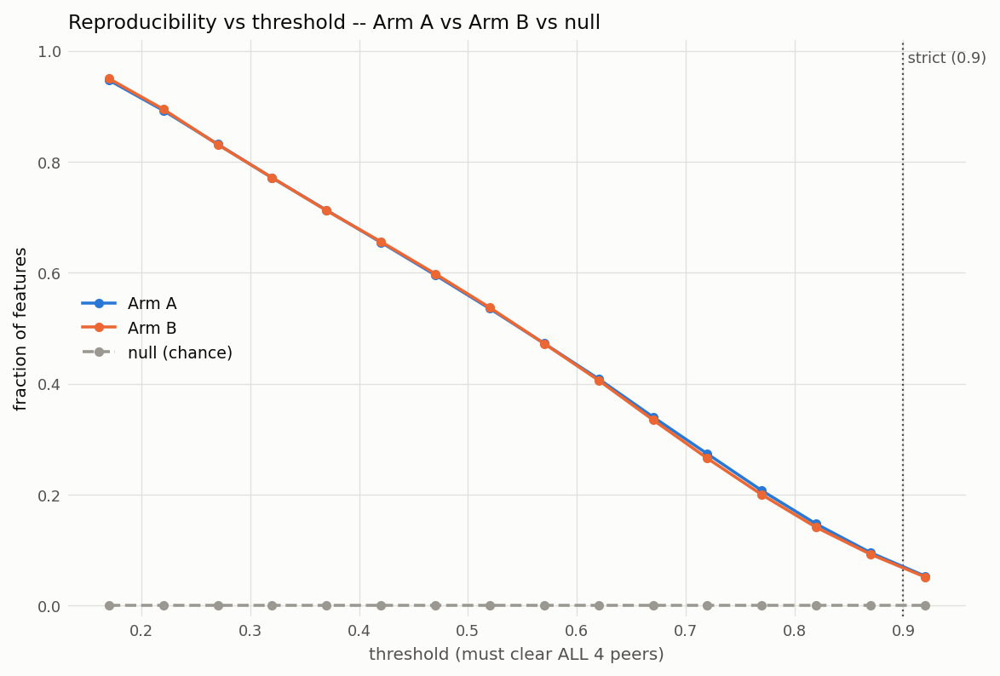
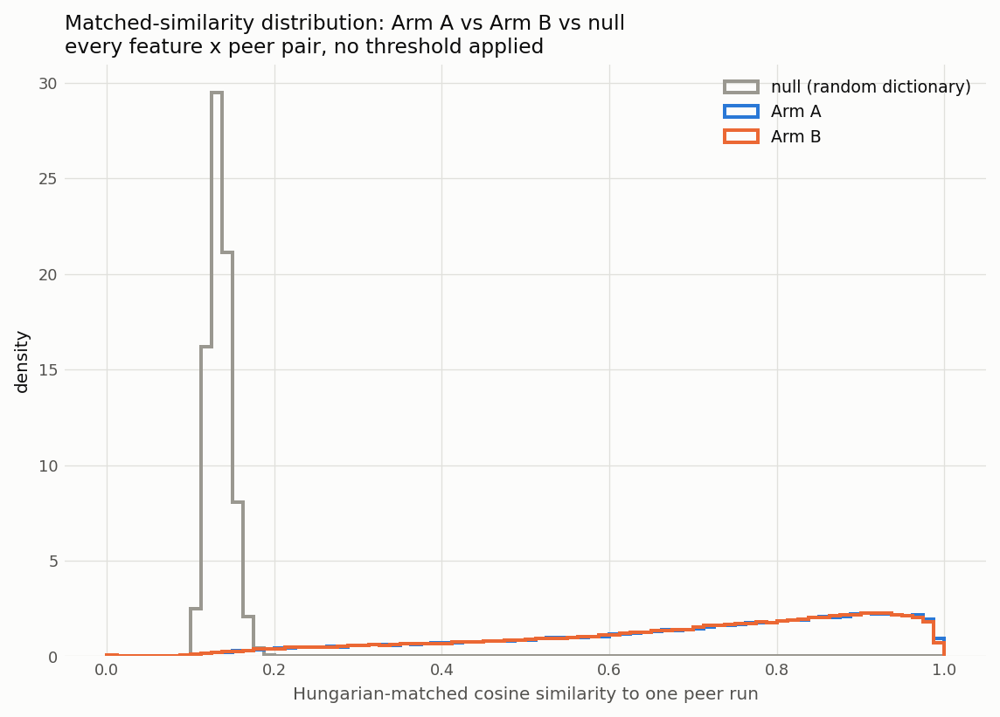
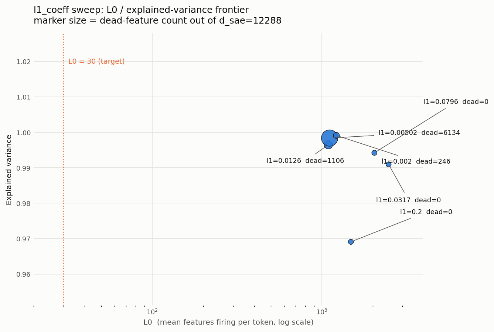

# Are SAE features real, or artifacts of the seed?

Across five sparse autoencoders trained on byte-identical GPT-2-small
activations — differing only in the weight-initialisation seed, everything
else pinned — only **6.9% of features reproduce at cosine similarity ≥0.9**
against all four other seeds, and **30% reproduce at ≥0.7**, against a chance
baseline of **0.14** from matching against random unit-norm dictionaries of
the same size. Most of what a single SAE finds is not there when you look
again with a different seed.

## The headline result

Reproducibility isn't one number — it's a curve, because "the same feature"
is a matter of how strict a match you require. This is Arm A and Arm B (5
seeds each) against the null:

<picture>
  <source media="(prefers-color-scheme: dark)" srcset="results/full/repro_threshold_curve_dark.png">
  
</picture>

Same underlying data with no threshold applied at all — every feature's
matched cosine similarity to each of its peers, plotted as a distribution:

<picture>
  <source media="(prefers-color-scheme: dark)" srcset="results/full/repro_distribution_dark.png">
  
</picture>

Both arms are far from chance and nearly indistinguishable from each other —
see [Limitations](#limitations) for what that arm comparison can and can't
support.

## Method, briefly

- **Model / hook point:** GPT-2 small, `blocks.8.hook_resid_pre` (layer 8 of
  12, residual stream, `d_model=768`).
- **Data:** 12.7M activations captured from 100k sequences of `pile-10k`,
  frozen to disk (fp16, ~18.2GB) so every one of the ten runs reads
  byte-identical data — the whole experiment depends on that.
- **SAE:** TopK (Gao et al., 2024), `k=30`, `d_sae=12288` (16× expansion),
  decoder rows held at unit norm throughout training.
- **Matching:** decoder rows are directionally comparable (unit norm), so
  cross-run correspondence is posed as a bipartite matching problem and
  solved with Hungarian assignment (`scipy.optimize.linear_sum_assignment`),
  not greedy max-cosine — greedy's collision rate against a random
  dictionary measured **67%**, i.e. two-thirds of "best matches" were
  claimed by more than one feature.
- **Null:** each real decoder is also matched against independently drawn
  random unit-norm dictionaries of the same size, so every threshold above
  is read off a measured chance level, not assumed against zero.

## Why TopK, not L1

The first attempt used a standard L1 penalty. It never worked, and the
reason is structural, not a tuning miss: L1 penalizes `sum(|f_i|)`, which by
construction can't distinguish 30 features firing at magnitude ~5 from 1000+
firing at magnitude ~0.15 when both sum to the same budget. A 100×
`l1_coeff` sweep (six values from `2e-3` to `2e-1`, then a narrower pass
across the transition) never got near the `L0≈30` target — it found two
failure regimes instead, a runaway dead-feature cascade below the transition
and non-convergence above it, with a flat floor around `L0≈1095` — **36×**
the target — everywhere in between:

| `l1_coeff` | L0 | dead |
|---|---|---|
| 0.002 | 1221 | 246 |
| 0.005 | 1114 | 6134 (still climbing) |
| 0.0126 | 1095 | 1106 |
| 0.0154 | 1099 | 204 (stable) |
| 0.0182 | 1122 | 23 (stable) |
| 0.0215 | 1226 | 1 |
| 0.0254 | 1601 | 0 |
| 0.032 – 0.2 | 1487 – 2482 | 0 |

<picture>
  <source media="(prefers-color-scheme: dark)" srcset="results/full/l1_sweep_frontier_dark.png">
  
</picture>

Decoder-norm inflation (the usual way an SAE escapes L1) was ruled out by
direct measurement — norms were pinned at exactly 1.0 throughout. TopK
replaces the penalty with a structural constraint (keep the `k` largest
pre-activations per token, zero the rest), and the very first run hit the
target exactly: `L0=30.0` from step 0, `EV=0.867`, `dead=2/12288`,
`loss_recovered=0.927`. Full diagnostic trail —
decoder-norm checks, the optimizer-failure hypothesis that didn't survive a
corrected loss calculation, and a mutual-incoherence check that came back
genuinely mixed — in [NOTES.md](NOTES.md), Phases 4-5. Kept, not deleted:
the L1 implementation, both sweep scripts, and both result files are still
in this repo. The sweep is a result, not a false start.

## Limitations

Stated here rather than left for a reviewer to find:

- **One layer, one model.** `blocks.8.hook_resid_pre` on GPT-2 small only.
  Nothing here claims to generalise to other layers or larger models.
- **~4.8 epochs over 12.7M unique activations** (15,000 steps × 4096 batch),
  against the hundreds of millions of unique activations used in published
  SAE work. This biases the result in a specific, statable direction: heavy
  re-epoching gives each seed more room to fit noise in the specific
  activations it happened to revisit, which **inflates** measured fragility.
  The reproducibility numbers above should be read as a **lower bound** on
  true stability — a larger-scale run would likely reproduce features more
  consistently than shown here, not less.
- **Cosine similarity of decoder directions is one definition of "the same
  feature."** Activation-pattern correlation across held-out data is a
  complementary test that was not run.
- **5 seeds per arm.** Enough to see the shape of the distribution, not
  enough to tightly characterise its tail.
- **The Arm A vs Arm B comparison is inconclusive at this scale**, not a
  null result. A two-sample KS test between their matched-similarity
  distributions found a statistically real difference (`p=5.1e-5`) — but
  with `n≈240,000` that test has power to detect a trivial effect, and the
  statistic itself (`0.0066`, max CDF gap under 1%) says the practical
  difference is negligible. This experiment can't support "data order adds
  no extra instability," and it can't support "data order matters,"
  either — see [NOTES.md](NOTES.md) Phase 5 for the full readout.
- **Steering hasn't been run.** Reproducibility here is a geometric
  property of decoder directions; whether a reproducible feature is also a
  *functionally useful* one — whether steering with it does what the
  max-activating examples suggest — is Phase 6, not yet done. A feature
  could be highly reproducible and functionally inert, or fragile-looking
  and still steerable. That link is future work.

## Reproduce it

Python 3.12 (TransformerLens doesn't have reliable 3.13 wheels yet):

```bash
python3.12 -m venv .venv && source .venv/bin/activate   # Windows: .venv\Scripts\activate
pip install torch --index-url https://download.pytorch.org/whl/cu121  # or `pip install torch` on Apple Silicon
pip install -r requirements.txt
```

Then, in order:

```bash
# 1. Cache activations -- ~18.2GB on disk; every run after this reads it byte-identical
python capture.py --preset full                                          # not benchmarked this session

# 2. Confirm the two-arm sampler design holds before spending GPU time on it
python test_sampler.py --preset full                                     # seconds

# 3. L1 sweep -- documented negative result, see "Why TopK, not L1" above
python sweep_l1.py                                                       # ~114 min (6 points x 15k steps)
python sweep_l1.py --l1_lo 0.013 --l1_hi 0.03 --n_points 6 \
    --out results/full/l1_sweep_narrow.json                              # ~95 min (5/6 -- 6th killed externally, not a bug)
python plot_l1_sweep.py --preset full
python plot_l1_transition.py --preset full

# 4. TopK confirmation run (single seed) before committing to all ten
python train.py --preset full --seed 0 --data_seed 0 --topk 30 \
    --n_steps 15000 --eval_every 5000 --run_name topk_k30                # 40.2 min

# 5. The 10-run reproducibility matrix (Arm A + Arm B, topk=30, saves
#    run_config.json beside every checkpoint)
python run_experiment.py                                                 # 3.55 h

# 6. Cross-seed matching, null calibration, and the plots above
python reproducibility.py                                                # ~13 min (60 Hungarian matches, ~12s each)
```

`reproducibility.py` refuses to run against a partial set of the ten
checkpoints rather than silently reporting a number from whichever runs
happen to exist.

Working notes, full diagnostic trail, and per-phase design rationale (what
broke, what I measured to find out why, what I'd say about it in an
interview): **[NOTES.md](NOTES.md)**.
